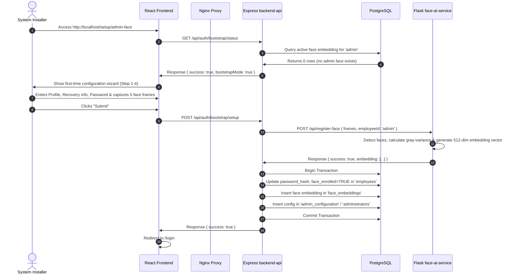
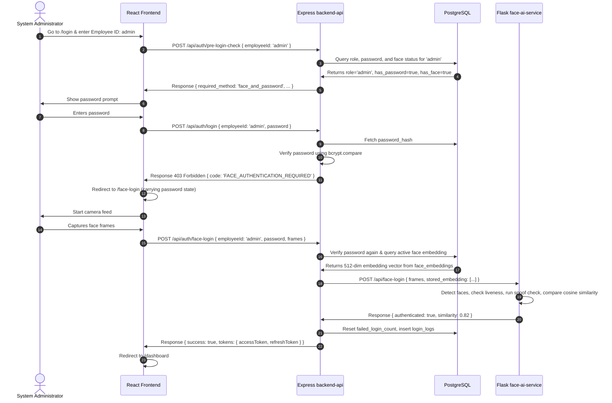
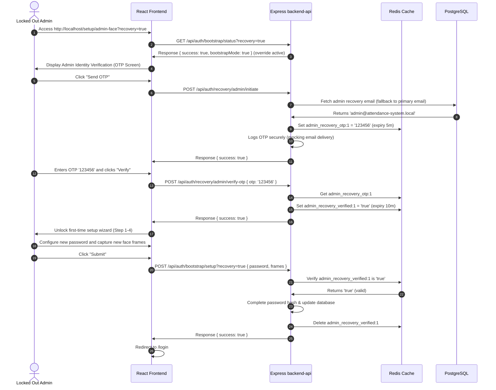
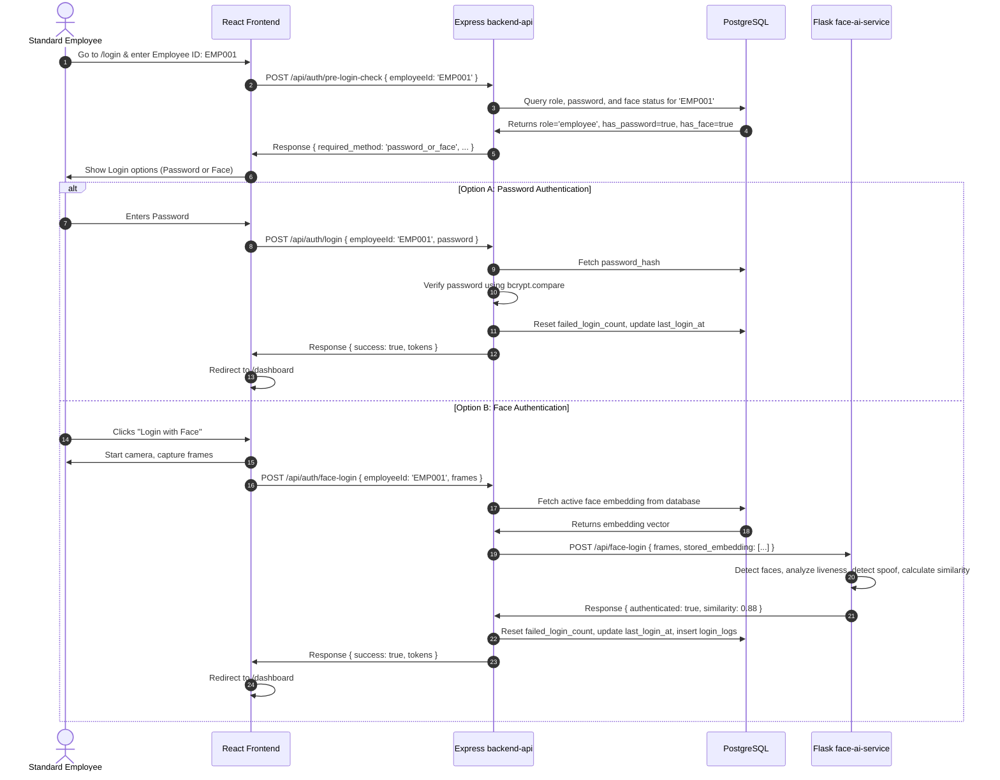

# AUTH FLOW MAP

This document details the precise verification steps and endpoint transitions across the system's authentication flows.

---

## 1. Admin Bootstrap Setup Flow (First Installation)

### Sequence Diagram

---

## 2. Normal Admin Login Flow

### Sequence Diagram

---

## 3. Secure Admin Recovery Flow (`?recovery=true`)

This flow allows a valid administrator to recover their password and face configuration in the event of lockouts or camera pipeline issues.

### Sequence Diagram

---

## 4. Employee Authentication Flow (Password or Face Login)

Unlike administrative accounts, standard employees are configured to authenticate using either their password or their face profile, based on their preference or dynamic security status.

### Sequence Diagram

