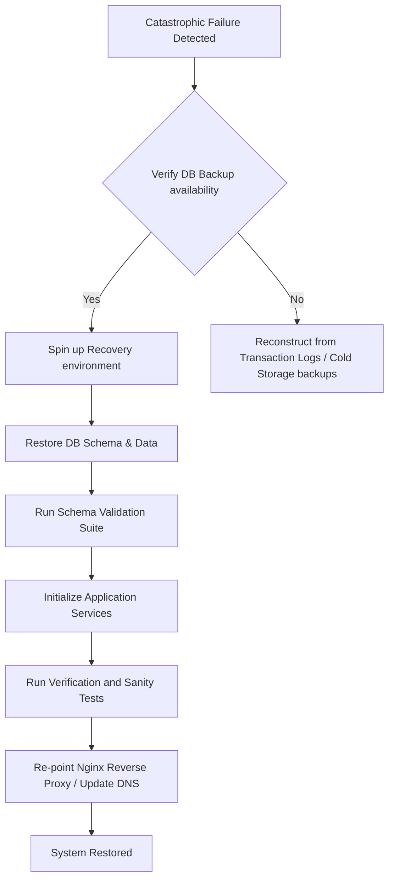

# DISASTER RECOVERY REPORT — ENTERPRISE ATTENDANCE PLATFORM

**Status**: READY / ACTIVE  
**Last Verified**: June 14, 2026  
**PostgreSQL Version**: 15 (Alpine)  
**Redis Version**: 7 (Alpine)  

---

## 1. EXECUTIVE RECOVERY STRATEGY

This document outlines the standard operating procedures for recovering the Enterprise Attendance System from catastrophic failure (data corruption, primary hardware failure, container stack failure, or network partitioning).



---

## 2. BACKUP POLICY & RETENTION

| Data Category | Target Table(s) | Back Up Frequency | Retention Window | Destination | Encryption |
|---|---|---|---|---|---|
| **Core Employee Records** | `employees`, `supervisor_assignments` | Daily | Permanent (soft-delete) | AWS S3 (Cold) | AES-256 |
| **Attendance Data** | `attendance_records` | Daily (Hourly logs) | Permanent (soft-delete) | AWS S3 (Cold) | AES-256 |
| **Security Metrics & Logs**| `security_events`, `login_logs`, `audit_logs` | Daily | 1 Year / Permanent | AWS S3 (Cold) | AES-256 |
| **Configuration Settings** | `office_locations`, `work_timings`, `leave_policy` | Daily | Permanent | AWS S3 (Cold) | AES-256 |

---

## 3. ACTIVE DATABASE BACKUP PROCEDURE

To generate a new snapshot of the database manually, run the following commands on the database host:

```bash
# 1. Connect to database host or use docker exec
docker exec -t attendance-db pg_dump -U postgres -d attendance_system > d:/Website/database/backup_attendance_20260614_235959.sql

# 2. Verify file size is non-zero
ls -lh d:/Website/database/backup_attendance_20260614_235959.sql
```

---

## 4. SYSTEM RESTORATION PLAYBOOK

In the event of database corruption or data loss:

### Step 4.1: Tear down compromised containers
```bash
docker compose -f docker-compose.yml down -v
```

### Step 4.2: Start database services
```bash
docker compose -f docker-compose.yml up -d postgres redis
```

### Step 4.3: Wait for database readiness
```bash
docker exec attendance-db pg_isready -U postgres
```

### Step 4.4: Restore base schema and data from backup
```bash
# Force database drop and recreation
docker exec attendance-db psql -U postgres -c "DROP DATABASE IF EXISTS attendance_system;"
docker exec attendance-db psql -U postgres -c "CREATE DATABASE attendance_system;"

# Stream backup into database container
docker exec -i attendance-db psql -U postgres -d attendance_system < d:/Website/database/backup_attendance_20260614_235959.sql
```

### Step 4.5: Start remaining services
```bash
docker compose -f docker-compose.yml up -d
```

---

## 5. RECOVERY SANITY VERIFICATION

Execute the following verification queries to validate data integrity post-recovery:

```sql
-- Count total active employees
SELECT COUNT(*) FROM employees WHERE is_active = TRUE;

-- Verify recent check-ins
SELECT COUNT(*) FROM attendance_records WHERE check_in_time >= CURRENT_DATE;

-- Verify geofence config loaded
SELECT COUNT(*) FROM office_locations WHERE is_active = TRUE;
```

---
*Report Compiled by Antigravity AI — Google DeepMind.*
