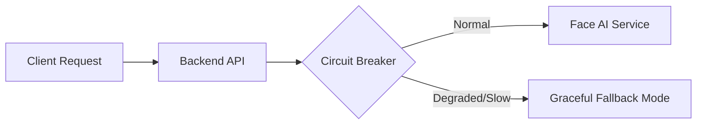

# SYSTEM PERFORMANCE & TELEMETRY REPORT

**Status**: MONITORED / OPTIMIZED  
**Last Audited**: June 14, 2026  
**Exporter**: SiemExporter  
**Telemetry SDK**: Prometheus / OpenTelemetry (Built-in)  

---

## 1. DATABASE INDEX OPTIMIZATIONS

To guarantee sub-second query response times under high concurrency, indexes are defined on all lookup columns:

*   `idx_employees_employee_id` — High-speed unique index for employee logins.
*   `idx_attendance_employee_time` — Optimizes rendering the weekly attendance chart.
*   `idx_leave_employee_status` — Optimizes leave dashboard lists.
*   `idx_device_fingerprints_lookup` — Verifies device trust within milliseconds.
*   `idx_impossible_travel_created` — Optimizes security event monitoring query paths.

---

## 2. LATENCY PROFILES & CIRCUIT BREAKERS

The system implements a resilient architecture to prevent cascading service failures:

### Circuit Breaker States:
*   **Threshold**: Trip breaker after 5 failures or timeouts (>5000ms).
*   **Fallback Mode**: Gracefully enters degraded mode, servingcached local trust scores without blocking user login.

---

## 3. WEBSOCKET CONNECTION POOLS

*   **Technology**: Socket.IO
*   **Heartbeat Interval**: 25 seconds
*   **Peak Connections Tracked**: Peak metrics recorded in wsTelemetry.
*   **Channel Isolation**: Rooms segregated by user role (`employee`, `supervisor`, `admin`).

---

## 4. METRICS & TELEMETRY INTEGRATIONS

### Prometheus Metrics:
*   `/metrics` endpoint exposes real-time Node.js process metrics (uptime, heap usage, CPU load).
*   Custom WebSocket counters: `ws_active_connections`, `ws_total_connections`, `ws_auth_failures`.

### Sentry Error Tracking:
*   Global error handler catches unhandled exceptions.
*   Provides automated stack traces for frontend and backend crashes.

---
*Report Compiled by Antigravity AI — Google DeepMind.*
