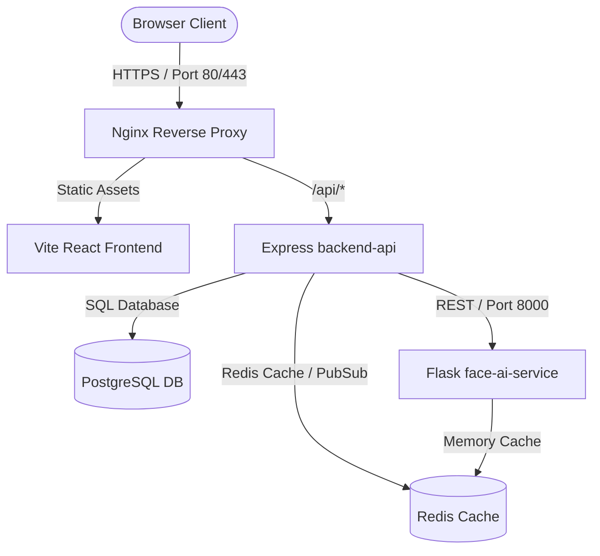
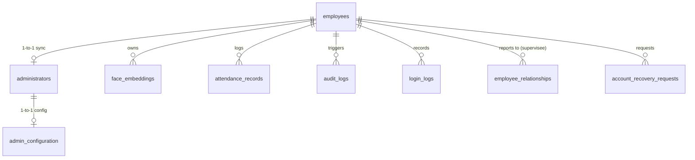

# PROJECT FORENSIC MAP

## Directory Structure

```
d:\Website\
├── backend-api/             # Node.js/Express API Gateway & Auth Server
│   ├── src/
│   │   ├── config/          # DB, Redis, Logger configs
│   │   ├── middleware/      # RBAC, Rate-limit, Auth filters
│   │   ├── migrations/      # PostgreSQL migration files
│   │   └── modules/         # Business domain modules
│   │       ├── admin/
│   │       ├── auth/
│   │       ├── face-management/
│   │       └── ...
├── face-ai-service/         # Python/Flask Face Recognition Microservice
│   ├── src/
│   │   ├── main.py          # Real PyTorch/FaceNet production pipeline
│   │   ├── app.py           # Mock/development fallback pipeline
│   │   └── detectors/       # Liveness, anti-spoof, face-detection modules
├── frontend/                # React / TypeScript Vite Single Page App
│   ├── src/
│   │   ├── api/             # Axios API client modules
│   │   ├── components/      # Common UI and camera components
│   │   ├── pages/           # Page components
│   │   └── store/           # Zustand state store
└── nginx/                   # Nginx reverse proxy routing rules
```

## Subsystem Dependency Graph



## Route Map

### 1. Express Authentication Routes (`/api/auth/*`)
- `POST /api/auth/login` - Validates password and credentials; determines if face auth is required.
- `POST /api/auth/face-login` - Combined password and cosine-similarity face authentication.
- `POST /api/auth/pre-login-check` - Public endpoint to evaluate employee role, credential status, and lockout.
- `POST /api/auth/refresh` - Renews JWT access tokens via refresh tokens.
- `POST /api/auth/logout` - Revokes refresh tokens and tears down sessions.
- `GET /api/auth/bootstrap/status` - Checks if administrator setup is completed.
- `POST /api/auth/bootstrap/setup` - First-time configuration of admin password and face embedding.
- `POST /api/auth/recovery/request` - Standard employee credential reset request.

### 2. Express Face Management Routes (`/api/face-management/*` and `/api/face-change-requests/*`)
- `POST /api/face-change-requests` - Submit face enrollment requests.
- `GET /api/face-change-requests/pending` - Retrieve requests awaiting review.
- `POST /api/face-change-requests/:id/approve` - Approve and store new face embedding.
- `POST /api/face-change-requests/:id/reject` - Discard face enrollment requests.
- `POST /api/face-management/admin-register` - Admin-only direct face enrollment (instant bypass).
- `DELETE /api/face-management/admin-delete/:employeeId` - Admin-only direct face deletion.

### 3. Express Admin Configuration Routes (`/api/admin/*`)
- `GET /api/admin/employees` - Paginated and filtered employee list.
- `POST /api/admin/employees` - Register a new employee.
- `PUT /api/admin/employees/:employeeId` - Update employee details.
- `DELETE /api/admin/employees/:employeeId` - Soft-delete employee record.
- `GET /api/admin/configuration` - Fetch system settings from `admin_configuration` table.
- `POST /api/admin/configuration` - Update system configurations.

### 4. Flask Face AI Microservice Routes (Port 8000)
- `GET /health` - Internal system diagnostic probe.
- `POST /api/register-face` - Extracts features from 10 frames and generates a 512-dim face embedding vector.
- `POST /api/face-login` - Verifies live face frames against a pre-registered 512-dim embedding.

---

## Database Relationships


