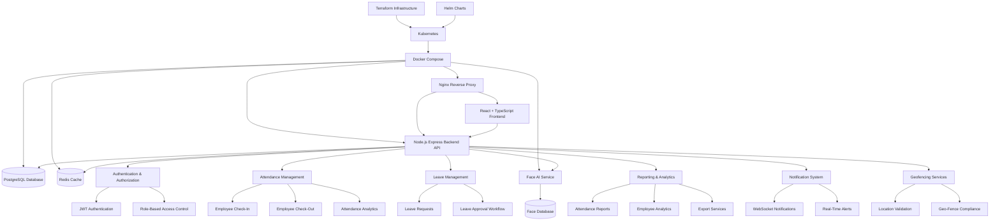

# Enterprise Employee Attendance & Face Recognition System

An enterprise-grade Employee Attendance Management System featuring biometric face recognition, role-based access control, leave management, real-time notifications, workforce analytics, geofencing, and secure authentication workflows.

---

## Overview

This platform provides a complete workforce attendance solution built using a modern microservice architecture.

The system combines:

* Traditional authentication
* Face recognition login
* Attendance tracking
* Leave management
* Reporting & analytics
* Security monitoring
* Geofencing
* Real-time notifications

The project is designed for enterprise environments requiring scalability, security, reliability, and auditability.
---

## Features Overview

### Authentication & Security

* Traditional Username & Password Authentication
* Face Recognition Login
* Multi-Factor Authentication (MFA)
* JWT-Based Authentication
* Role-Based Access Control (RBAC)
* Security Monitoring & Audit Logging

### Attendance Management

* Employee Check-In / Check-Out
* Attendance History Tracking
* Real-Time Attendance Monitoring
* Attendance Analytics
* Geo-Fence Compliance Verification

### Face Recognition System

* Face Enrollment
* Face Verification
* Face Login Authentication
* Anti-Spoofing Protection
* Liveness Detection
* Biometric Recovery Support

### Workforce Management

* Employee Management
* Leave Request Submission
* Leave Approval Workflow
* Department Monitoring
* Supervisor Dashboard

### Reporting & Analytics

* Attendance Reports
* Employee Activity Reports
* Dashboard Analytics
* Exportable Reports
* Workforce Insights

### Enterprise Features

* Docker Deployment
* Kubernetes Support
* Helm Charts
* Terraform Infrastructure
* Redis Caching
* WebSocket Notifications
* Health Monitoring
* Observability & Telemetry


## Screenshots

### Login Page


### Face Recognition Login


### Dashboard


### Leave Management


### Reports & Analytics


### Admin Management


## Architecture



### System Components

| Component              | Purpose                                                               |
| ---------------------- | --------------------------------------------------------------------- |
| Frontend               | Employee and Administrator interface                                  |
| Backend API            | Core business logic and API services                                  |
| PostgreSQL             | Core application data storage                                         |
| Redis                  | Caching, session management, and performance optimization             |
| Face AI Service        | Face recognition, biometric authentication, and liveness verification |
| Face Database          | Facial embeddings and biometric records                               |
| Authentication Service | JWT authentication and access control                                 |
| Attendance Management  | Check-in, check-out, and attendance tracking                          |
| Leave Management       | Leave requests and approval workflows                                 |
| Reporting & Analytics  | Reports, analytics, and workforce insights                            |
| Notification System    | Real-time alerts and WebSocket notifications                          |
| Geofencing Service     | Location validation and compliance verification                       |
| Nginx                  | Reverse proxy and traffic routing                                     |
| Docker Compose         | Local container orchestration                                         |
| Kubernetes             | Production container orchestration                                    |
| Helm                   | Kubernetes package management                                         |
| Terraform              | Infrastructure provisioning and automation                            |

### Data Flow

1. Users access the application through the React frontend.
2. Requests are routed through Nginx to the Backend API.
3. The Backend API handles authentication, attendance, leave management, analytics, and reporting.
4. Face authentication requests are forwarded to the Face AI Service.
5. User and attendance data are stored in PostgreSQL.
6. Redis provides caching, session management, and performance optimization.
7. Real-time updates are delivered through WebSocket notifications.
8. Geofencing services validate employee locations during attendance operations.
9. Docker and Kubernetes provide deployment and scalability infrastructure.


## Core Features

### Authentication

* JWT Authentication
* Face Recognition Login
* Multi-Factor Authentication (MFA)
* Password-Based Login
* Role-Based Access Control (RBAC)

### Attendance Management

* Employee Check-In
* Employee Check-Out
* Attendance History
* Attendance Analytics
* Real-Time Attendance Updates

### Face Recognition

* Face Enrollment
* Face Verification
* Face Login
* Anti-Spoofing Support
* Liveness Detection
* Face Embedding Management

### Workforce Management

* Leave Requests
* Leave Approval Workflow
* Work Reports
* Employee Tracking
* Supervisor Dashboard

### Reporting & Analytics

* Attendance Reports
* Employee Statistics
* Dashboard Analytics
* Export Functionality
* Excel Report Generation

### Security

* Rate Limiting
* Security Monitoring
* Audit Logging
* JWT Security
* Helmet Security Headers
* Request Validation

### Enterprise Operations

* Telemetry Collection
* Distributed Tracing
* Health Monitoring
* Circuit Breakers
* Degraded Mode Support
* WebSocket Notifications
---

## Technology Stack

### Frontend

* React
* TypeScript
* Vite
* React Router
* Zustand
* Recharts
* Framer Motion
* React Webcam

### Backend

* Node.js
* Express.js
* PostgreSQL
* Redis
* Socket.IO
* JWT
* Bcrypt

### AI Service

* Python
* Face Recognition Models
* OpenCV
* Anti-Spoofing Detection
* Liveness Verification

### Infrastructure

* Docker
* Docker Compose
* Nginx
* Kubernetes
* Helm
* Terraform

---

## Repository Structure

```text
.
├── frontend/
│   ├── src/
│   ├── public/
│   └── package.json
│
├── backend-api/
│   ├── src/
│   ├── migrations/
│   └── package.json
│
├── face-ai-service/
│   ├── models/
│   ├── services/
│   └── requirements.txt
│
├── database/
│   └── init.sql
│
├── nginx/
│
├── deployment/
│
├── k8s/
│
├── helm/
│
├── terraform/
│
└── docker-compose.yml
```
---

## User Roles

### Admin

* Manage users
* System configuration
* Security monitoring
* Face enrollment approval
* Access reports
* Platform administration

### Supervisor

* Team oversight
* Attendance monitoring
* Leave approvals
* Workforce reporting

### Employee

* Attendance check-in/out
* Face login
* Leave requests
* Personal reports
* Profile management

---

## Main Routes

### Public

```text
/login
/face-login
/setup/admin-face
/recovery-request
```

### Protected

```text
/dashboard
/attendance
/leave
/reports
```

### Supervisor

```text
/supervisor
```

### Admin

```text
/admin
/security
/system-status
```
---

## Quick Start

### Clone Repository

```bash
git clone <repository-url>
cd Website
```

### Environment Variables

```bash
cp .env.example .env
```

Configure:

```env
DB_NAME=attendance_system
DB_USER=postgres
DB_PASSWORD=<your_database_password>

FACE_DB_NAME=attendance_face_system
FACE_DB_USER=face_admin
FACE_DB_PASSWORD=<your_face_database_password>

REDIS_PASSWORD=<your_redis_password>

JWT_ACCESS_SECRET=<your_jwt_access_secret>
JWT_REFRESH_SECRET=<your_jwt_refresh_secret>
```
---

## Docker Deployment

Start all services:

```bash
docker compose up -d --build
```

Check status:

```bash
docker compose ps
```

View logs:

```bash
docker compose logs -f
```

Stop services:

```bash
docker compose down
```

---

## Services

| Service         | Port |
| --------------- | ---- |
| Frontend        | 3000 |
| Backend API     | 3001 |
| Face AI Service | 8000 |
| PostgreSQL      | 5432 |
| Face PostgreSQL | 5433 |
| Redis           | 6379 |

---

## Health Checks

Backend:

```bash
curl http://localhost:3001/health
```

Face AI:

```bash
curl http://localhost:8000/health
```

---

## Security Features

* JWT Access Tokens
* Refresh Tokens
* MFA Support
* Rate Limiting
* Request Validation
* Secure Headers
* Audit Logging
* Security Monitoring
* Face Verification Controls

---

## Monitoring & Observability

* Application Telemetry
* Request Tracing
* Correlation IDs
* Health Monitoring
* Circuit Breakers
* Alerting Infrastructure
* Service Status Dashboard

---

## Development

Frontend:

```bash
cd frontend
npm install
npm run dev
```

Backend:

```bash
cd backend-api
npm install
npm run dev
```

Face AI Service:

```bash
cd face-ai-service
pip install -r requirements.txt
python app.py
```

---

## License

This project is licensed under the Apache License, Version 2.0.

You may obtain a copy of the License at:

http://www.apache.org/licenses/LICENSE-2.0

Unless required by applicable law or agreed to in writing, software distributed under the License is distributed on an "AS IS" BASIS, WITHOUT WARRANTIES OR CONDITIONS OF ANY KIND, either express or implied.

See the LICENSE file for the specific language governing permissions and limitations under the License.
